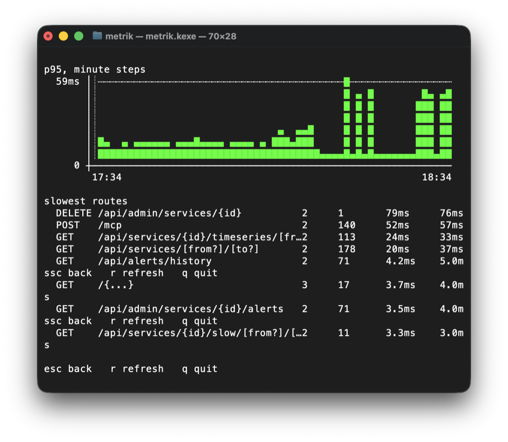

# metrik-cli — дашборд без браузера

Один нативный бинарь, который показывает то же, что и веб-дашборд, но в терминале. Собирается под
`linuxX64`, `linuxArm64` и `macosArm64`.



> Снимок сделан **до** M-112 и показывает три дефекта, которые на нём и обнаружились: тройная
> подсказка по клавишам, перенос правой колонки и пунктир порога на 59 мс при пороге 1000.
> Все три исправлены — снимок стоит переснять.

## Зачем он есть

Не «чтобы было по-хакерски». Замер по M-99 показал: полка потребления памяти сервера равна числу
потоков, умноженному примерно на 1.94 МиБ, а потоки растит **параллельность HTTP и только она** —
приём по UDP не стоит ничего. Единственный источник этой параллельности — браузерная страница,
которая разом тянет html, wasm, шрифты и пачку вызовов API. Клиент в терминале делает несколько
последовательных запросов и веера не создаёт.

Поэтому дашборд в чарте можно выключить (`web.enabled: false`) — API, алертинг и MCP остаются.

## Как он ходит за данными

**Через MCP, а не через `/api`.** Это решение, а не случайность: `/api` стоит за oauth2-proxy,
который логинится браузером, и дотянуться туда из терминала значило бы завести второй способ входа
и охранять его вечно. `/mcp` — уже дверь для машин, с токеном и обходом ingress.

Ответы разбираются в **те же DTO из `:shared`**, которыми пользуется дашборд: инструменты MCP
кодируют их тем же `MetrikJson`. Второй копии контракта не существует, и переименованное поле
ломает сборку, а не экран.

## Запуск

```
metrik            # список сервисов
metrik hub        # сразу карточка сервиса
metrik --help
```

| переменная | смысл |
|---|---|
| `METRIK_URL` | базовый адрес, например `https://metrik.example.com` (обязателен) |
| `METRIK_TOKEN` | тот же токен, что у сервера в `METRIK_MCP_TOKEN` (обязателен) |
| `METRIK_WINDOW` | сколько минут истории на графике, по умолчанию 60 |
| `METRIK_REFRESH` | период обновления в секундах, по умолчанию 30 |
| `NO_COLOR` | любое значение выключает цвет |
| `METRIK_ASCII` | любое значение переключает на запасной набор символов |

Клавиши: `↑↓` или `j`/`k` — движение, `enter` — открыть, `esc` — назад, `r` — обновить,
`q` — выйти.

## Что он рисует и почему именно так

**Разрыв — не ноль.** Минута, за которую сервис ничего не прислал, рисуется `┊`, а не столбиком
нулевой высоты. Это не косметика: сервер отдаёт точку **только для окон, которые отчитались**, то
есть молчавший двадцать минут сервис приезжает более коротким рядом, а не рядом с дырой. Нарисуй
его как есть — и линия пройдёт сквозь аварию гладко. Клиент восстанавливает сетку запрошенного
окна и помечает разрывом каждый шаг, о котором никто не отчитался; точки с `partial` — тоже
разрывы, неполное окно не измерение.

**Цвет — второй канал, никогда не единственный.** Раскраска идёт по **настоящим порогам сервиса**
(инструмент `alert_rules`), а не по константам: красное — то, на чём сработало бы правило.
Выключенное правило порогов не даёт, и тогда график просто не красит — это честнее выдуманного
порога.

**Пунктир порога рисуется, только если порог попадает в шкалу.** Раньше позиция зажималась в
границы поля, и порог выше максимума прилипал к верхней строке: график с пиком 59 мс утверждал, что
порог — 59 мс. Линия, которая всегда где-то есть, не сообщает ничего, а притворяется, что сообщает. Чтобы это читалось и без цвета, порог рисуется пунктиром поперёк
поля, у разрыва свой символ, а горящий сервис в списке помечен `!`. `NO_COLOR` уважается.

**Прореживание усредняет, а не выбрасывает.** Ряд длиннее терминала сжимается усреднением соседей:
выбрасывание каждой n-й точки потеряло бы ровно тот всплеск, ради которого график открывают.
Корзина, в которую попал разрыв, остаётся разрывом.

**Ненулевое значение занимает хотя бы один уровень.** Иначе 10 мс на фоне пика в 420 округляются
в пустоту, и «мало», «ноль» и «нет данных» выглядят одинаково.

**Кадр обрезается по размеру терминала.** Mosaic перерисовывает на месте: поднимает курсор на
столько строк, сколько нарисовал. Кадр выше экрана ломает эту арифметику, и обрывки прошлого кадра
остаются поверх нового — на снимке выше подсказка по клавишам напечаталась трижды. Теперь строки
режутся по ширине многоточием, а по высоте — окном, которое едет за выбранной строкой.

## Ограничения

Клиент только читает. Заглушить правило, поменять порог или удалить сервис через него нельзя — это
делается в дашборде. Инструмент диагностики, умеющий менять состояние, однажды поменяет его вместо
диагностики.

Без терминала (в пайпе, в CI) Mosaic не рисует вовсе и говорит об этом. Это ограничение библиотеки,
а не решение: для машинного чтения есть MCP, и он для этого и предназначен.
